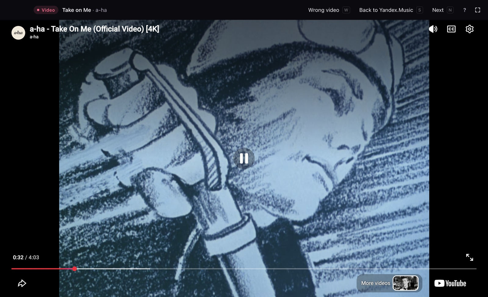

# Tapeclip

**Your music, now with the music video.**

Play a song in Spotify, Yandex.Music or Apple Music. Tapeclip finds its official music video and plays it.
When the video ends, your player moves on to the next track, and the next video starts.

**[Download Tapeclip 0.1.3 for Mac](../../releases/latest)**

## What it does

- **Follows your player.** Spotify, Yandex.Music, Apple Music, Deezer, Tidal and Amazon Music. Your queue, shuffle, radio and Spotify Jam keep working.
- **Finds the official video,** not covers, lyric videos or reuploads. Not sure? It shows no video rather than the wrong one.
- **Hands audio back and forth.** Video found: the player pauses and the video plays with sound. No video: your player keeps playing, and Tapeclip shows the cover and synced lyrics.
- **Plays the uncut original.** Russian releases get edited, Spotify included. Press <kbd>C</kbd> on an edited song and Tapeclip plays the original instead.
- **Minimize with <kbd>Esc</kbd>,** skip story intros automatically, and fix a wrong video with <kbd>W</kbd>.
- **Updates itself.**

<table>
  <tr>
    <td></td>
    <td></td>
  </tr>
  <tr>
    <td align="center">Minimized video with lyrics</td>
    <td align="center">No video: your player keeps playing</td>
  </tr>
</table>

## Install

1. Download the disk image for your Mac:
   - **Apple Silicon** (M1 and newer): `Tapeclip-0.1.3-arm64.dmg`
   - **Intel**: `Tapeclip-0.1.3-x64.dmg`

   Not sure which one? Apple menu → About This Mac: “Chip: Apple M…” is Apple Silicon, “Processor: Intel” is Intel.
2. Open the dmg and drag **Tapeclip** into **Applications**. Start it from Applications, not from the disk image: only an installed copy can update itself.
3. **First launch.** Tapeclip is not signed with an Apple developer certificate yet, so macOS stops it the first time with “Tapeclip” Not Opened. Click **Done**, then:
   - open **System Settings → Privacy & Security**, scroll down to “Tapeclip was blocked…”, click **Open Anyway** and confirm with your password;
   - or run this once in Terminal: `xattr -dr com.apple.quarantine /Applications/Tapeclip.app`

   You only do this once. Updates install without it.
4. **Spotify users:** macOS asks whether Tapeclip may control Spotify. Click **Allow**. Missed it? System Settings → Privacy & Security → Automation → Tapeclip → turn on Spotify. Yandex.Music, Apple Music and the other players need no permission.

Requires macOS 12 or later.

## Using Tapeclip

Play any song in your player and leave the Tapeclip window open. Press <kbd>?</kbd> in Tapeclip for the keyboard shortcuts.

- **Wrong video?** Press <kbd>W</kbd>. Tapeclip never shows it for that song again.
- **The song sounds edited** (cut words, beeps, changed lines)? Press <kbd>C</kbd> or click **Censored?** From then on Tapeclip plays the uncut original of that song for you, and your mark counts toward flagging it for every listener.

## Updates

Tapeclip checks for updates at launch and every 6 hours. When one is ready, a message appears at the bottom of the window: click **Restart**.

## Privacy

Tapeclip reads what your player is playing on your Mac; it never asks for your Spotify or Yandex account. To find videos it sends the artist, title and length of the song to the Tapeclip server, with a random install id. No names, no accounts; the server does not store IP addresses.

## Feedback

Found a wrong video, a bug, or a player that does not work? [Open an issue](../../issues/new). Screenshots help.

---

This repository holds Tapeclip releases only; the source code is private. Tapeclip includes [mediaremote-adapter](https://github.com/ungive/mediaremote-adapter) (BSD-3-Clause). Spotify, Yandex.Music, Apple Music, YouTube and other names are trademarks of their owners; Tapeclip is not affiliated with any of them.
